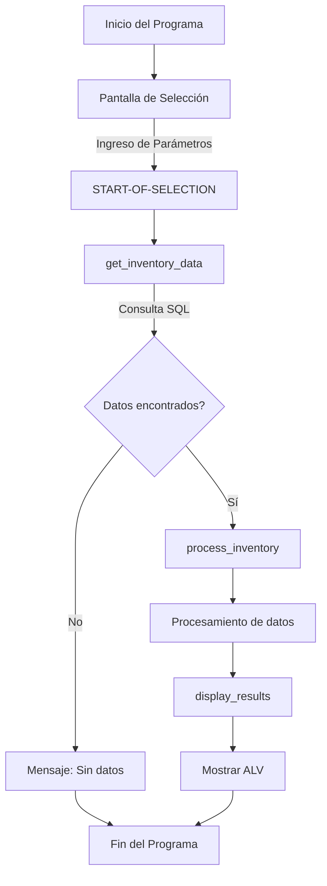

# Manual Técnico: Sistema de Gestión de Inventario para Hotel de Lujo
  

## Resumen Ejecutivo

El programa **ZHOTEL_INVENTORY_MGT** es un sistema de gestión de inventario desarrollado específicamente para el Hotel de Lujo. Permite a los usuarios consultar, monitorear y reportar el inventario completo de productos y materiales a través de diferentes ubicaciones (centros y almacenes). Este sistema integra información de productos, descripciones, cantidades disponibles y valoración financiera, proporcionando una visión consolidada del inventario para facilitar la toma de decisiones operativas y financieras.

## Propósito y Funcionalidad

### Propósito Principal

El sistema tiene como objetivo principal proporcionar una herramienta centralizada para la gestión eficiente del inventario del hotel, permitiendo:

- **Monitoreo preciso** de los niveles de stock en tiempo real
- **Valoración financiera** del inventario actualizada
- **Control de ubicaciones** específicas de los materiales
- **Generación de informes** para la toma de decisiones
- **Soporte para auditorías** de inventario y financieras

### Funcionalidades Clave

1. **Consulta flexible de inventario**: Filtrado por material, centro y almacén
2. **Visualización multilingüe**: Soporte para mostrar descripciones en español
3. **Valoración financiera**: Visualización de valores y monedas asociadas
4. **Presentación consolidada**: Agrupación y procesamiento de datos para mejor análisis
5. **Exportación de datos**: Capacidad de exportar resultados (implementación pendiente)

## Prerrequisitos Técnicos

### Sistema Base
- **SAP ERP** versión 6.0 o superior
- **Kernel SAP** 7.4x o superior
- **ABAP** Stack 7.5 o superior

### Autorizaciones Requeridas
| Objeto de Autorización | Valor | Descripción |
|------------------------|-------|-------------|
| S_TABU_DIS | ACTVT=03, DICBERCLS=&NC& | Visualización de tablas |
| M_MATE_WRK | ACTVT=03, WERKS=* | Visualización de materiales por centro |
| M_MATE_STL | ACTVT=03 | Visualización de listas de materiales |
| S_PROGRAM | P_ACTION=SUBMIT, P_GROUP=ZHT_INVENTORY | Ejecución de programas |

### Dependencias de Tablas SAP Estándar
- Tabla de materiales (MARA)
- Tabla de descripciones de materiales (MAKT)
- Tabla de datos de stock por almacén (MARD)
- Tabla de valoración de materiales (MBEW)

## Parámetros de Configuración

### Parámetros de Selección

| Parámetro | Tipo | Obligatorio | Descripción |
|-----------|------|-------------|-------------|
| s_matnr | SELECT-OPTION | No | Rango de selección para números de material |
| s_werks | SELECT-OPTION | No | Rango de selección para centros/plantas |
| s_lgort | SELECT-OPTION | No | Rango de selección para almacenes |
| p_date | PARAMETER | Sí | Fecha de referencia (por defecto: fecha actual) |

### Configuración Adicional (tabla Z personalizada)

> Nota: Implementación pendiente - La tabla ZHOTEL_INV_CONFIG se utilizará en futuras versiones para personalización de visualización y reglas de negocio.

## Tablas Involucradas

### Tablas SAP Estándar
| Tabla | Descripción | Campos Utilizados | Propósito |
|-------|-------------|-------------------|-----------|
| MARA | Maestro de Materiales | MATNR | Información general de los materiales |
| MAKT | Descripción de Materiales | MATNR, MAKTX, SPRAS | Textos descriptivos en múltiples idiomas |
| MARD | Datos de Almacén | MATNR, WERKS, LGORT, LABST | Cantidades de stock por almacén |
| MBEW | Valoración de Materiales | MATNR, VERPR, WAERS | Precios y monedas |

### Tablas Personalizadas
> Actualmente no se utilizan tablas personalizadas. En futuras versiones se implementará la tabla ZHOTEL_INV_CONFIG.

### Estructura de Datos Interna
```
DATA: BEGIN OF gt_inventory,
        matnr TYPE mara-matnr,   // Número de material
        maktx TYPE makt-maktx,   // Descripción de material
        werks TYPE mard-werks,   // Centro/planta
        lgort TYPE mard-lgort,   // Almacén
        labst TYPE mard-labst,   // Stock disponible
        verpr TYPE mbew-verpr,   // Precio
        waers TYPE mbew-waers,   // Moneda
      END OF gt_inventory.
```

## Flujo de Proceso



### Descripción de los Pasos Principales

1. **Pantalla de Selección**:
   - El usuario ingresa los criterios de filtrado (s_matnr, s_werks, s_lgort)
   - El sistema establece p_date como fecha actual por defecto

2. **get_inventory_data**:
   - Ejecuta la consulta SQL con JOIN de las tablas MARA, MAKT, MARD, MBEW
   - Filtra datos según parámetros proporcionados
   - Almacena resultados en la tabla interna lt_inventory

3. **process_inventory** (pendiente implementación completa):
   - Potencial para agregar lógica de negocio adicional
   - Preparación de datos para visualización
   - Cálculos adicionales si fuesen necesarios

4. **display_results**:
   - Formatea y presenta los datos utilizando ALV Grid
   - Permite ordenamiento y filtrado interactivo
   - Opciones para exportar datos (a implementar)

## Posibles Errores y Soluciones

| Código | Mensaje | Causa | Solución |
|--------|---------|-------|----------|
| MSG-001 | No se encontraron datos para los criterios seleccionados | Filtros demasiado restrictivos | Ampliar los rangos de selección o verificar que existan datos para los criterios |
| DBIF_RSQL_INVALID_RSQL | Error en la consulta SQL | Problema con la estructura de la consulta | Verificar el código ABAP en la forma GET_INVENTORY_DATA |
| DBIF_RSQL_SQL_ERROR | Error de acceso a la base de datos | Problemas de permisos o conectividad con DB | Verificar autorizaciones de usuario y conectividad SAP-DB |
| CONVT_NO_NUMBER | Error de conversión | Problema al convertir valores | Verificar formato de los campos numéricos |
| CX_SY_OPEN_SQL_DB | Error en Open SQL | Error en la ejecución de la consulta | Revisar sintaxis SQL y disponibilidad de tablas |

### Mensajes de Diagnóstico Comunes

- **Sin datos**: Verificar que exista inventario para los materiales seleccionados
- **Error en JOINs**: Verificar que los materiales existan en todas las tablas necesarias
- **Problemas de rendimiento**: Para grandes volúmenes de datos, considerar añadir índices adicionales

## Mantenimiento

### Plan de Mantenimiento Recomendado

| Actividad | Frecuencia | Descripción |
|-----------|------------|-------------|
| Verificación de rendimiento | Mensual | Analizar tiempos de ejecución y optimizar consultas SQL |
| Actualización de índices | Trimestral | Revisar y ajustar índices para mejorar rendimiento |
| Validación de datos | Mensual | Comparar resultados con inventario físico |
| Backup de configuración | Cuando cambia | Guardar copia de seguridad del código y configuración |
| Revisión de autorizaciones | Semestral | Verificar que los permisos estén correctamente asignados |

### Extensibilidad y Modificaciones Futuras

El programa está diseñado para permitir las siguientes extensiones:

1. **Módulo de exportación**: Implementación de funcionalidad para exportar a Excel/CSV
2. **Integración con inventario físico**: Comparación con conteos físicos
3. **Dashboard interactivo**: Visualización gráfica de niveles de inventario
4. **Alertas de stock mínimo**: Notificaciones automáticas
5. **Histórico de inventario**: Seguimiento de cambios en el tiempo

### Contacto para Soporte Técnico

- **Equipo**: Desarrollo SAP ABAP
- **Responsable**: Departamento IT
- **Email**: soporte.sap@hotellujo.com
- **Ticket System**: https://servicedesk.hotellujo.com/sap

---

## Apéndice A: Estructura Completa del Código

```abap
*&---------------------------------------------------------------------*
*& Report ZHOTEL_INVENTORY_MGT
*&---------------------------------------------------------------------*
*& Gestión de Inventario para Hotel de Lujo
*&---------------------------------------------------------------------*
REPORT zhotel_inventory_mgmt.

TABLES: mara, makt, mbew, mard.

DATA: BEGIN OF gt_inventory,
        matnr TYPE mara-matnr,
        maktx TYPE makt-maktx,
        werks TYPE mard-werks,
        lgort TYPE mard-lgort,
        labst TYPE mard-labst,
        verpr TYPE mbew-verpr,
        waers TYPE mbew-waers,
      END OF gt_inventory.

DATA: lt_inventory LIKE TABLE OF gt_inventory.

SELECT-OPTIONS: s_matnr FOR mara-matnr,
                s_werks FOR mard-werks,
                s_lgort FOR mard-lgort.

PARAMETERS: p_date TYPE sy-datum DEFAULT sy-datum.

START-OF-SELECTION.
  PERFORM get_inventory_data.
  PERFORM process_inventory.
  PERFORM display_results.

*&---------------------------------------------------------------------*
*&      Form  GET_INVENTORY_DATA
*&---------------------------------------------------------------------*
FORM get_inventory_data.
  SELECT m~matnr
         t~maktx
         d~werks
         d~lgort
         d~labst
         b~verpr
         b~waers
    FROM mara AS m
    INNER JOIN makt AS t ON m~matnr = t~matnr
    INNER JOIN mard AS d ON m~matnr = d~matnr
    INNER JOIN mbew AS b ON m~matnr = b~matnr
    INTO TABLE lt_inventory
    WHERE m~matnr IN s_matnr
      AND d~werks IN s_werks
      AND d~lgort IN s_lgort
      AND t~spras = 'ES'.
ENDFORM.
```

## Apéndice B: Historial de Versiones

| Versión | Fecha | Autor | Cambios |
|---------|-------|-------|---------|
| 1.0 | 22.10.2025 | Departamento IT | Versión inicial |

---

*Documento generado el 22 de octubre de 2025*  
*Hotel de Lujo + Relojería Barcelona*